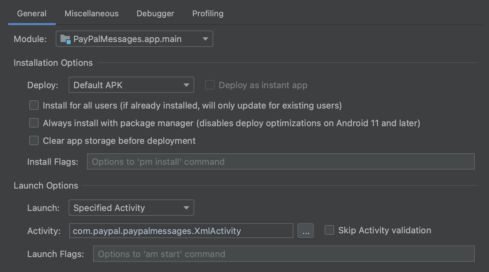
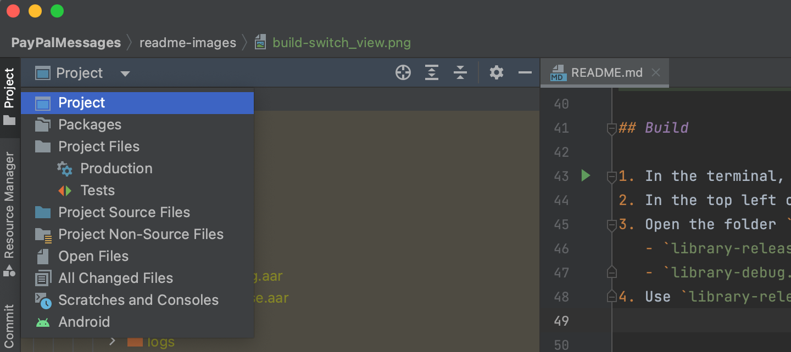
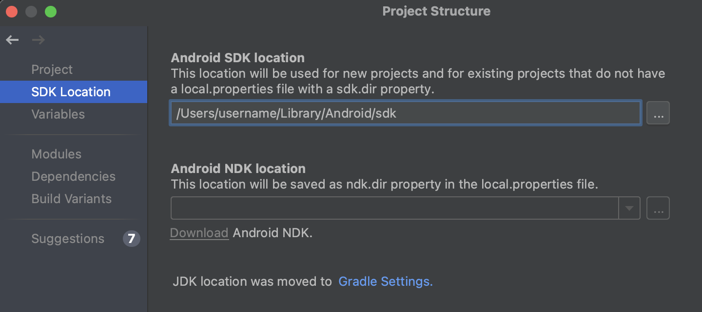
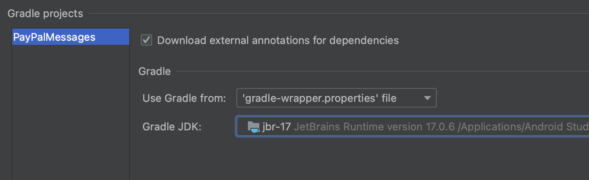

# PayPalMessages

## Run

There are two activities that can be run for PayPalMessages:

- [JetpackActivity](demo/src/main/java/com/paypal/messagesdemo/JetpackActivity.kt)
	- Uses [Jetpack Compose](https://developer.android.com/jetpack/compose) to render PayPalMessages
	- Jetpack Compose is the new way to render Android UI, [since 2021](https://android-developers.googleblog.com/2021/07/jetpack-compose-announcement.html)
	- **Note**: The Jetpack view does not currently work to show PayPalMessages
- [XmlActivity](demo/src/main/java/com/paypal/messagesdemo/XmlActivity.kt)
	- Uses traditional [XML Layouts](https://developer.android.com/develop/ui/views/layout/declaring-layout)

To run either activity:

1. Open your run configurations
2. If you don't have any run configurations, create one
	- It is suggested to create two configurations, one for running JetpackActivity and one for running XmlActivity
3. Under the **General** tab of the configuration, modify Launch Options
	- Set **Launch** to **Specified Activity**
	- Set **Activity** to one of the above activities
		- com.paypal.messages demo.JetpackActivity
		- com.paypal.messages demo.XmlActivity



### Environment Variables

Add environment variables to your shell config file (`~/.zshrc`, `~/.bashrc`, so on)

```
export UPSTREAM_ANDROID_STAGE_URL=""
export UPSTREAM_ANDROID_STAGE_VPN_URL=""
export UPSTREAM_ANDROID_LOCAL_URL=""
```

### Set Demo Client ID

Set the demo's client ID inside of [demo locals](demo/src/main/res/values/locals.xml)

### Ignored Files

To prevent commits of sensitive data, tell git to ignore future changes to some files, including:

- [demo locals](demo/src/main/res/values/locals.xml)

Run `./scripts/ignore-files.sh -y`, which will tell git to ignore the files above.

To see how to stop ignoring files or to list ignored files, see [ignore-files.sh](scripts/ignore-files.sh)

### Logcat Debugging

For ease of debugging, it is suggested to set Logcat to clear and show automatically.

To set that up:

1. Open your run configurations
2. Select the run configuration to modify
3. Under the **Miscellaneous** tab of the configuration, modify Logcat
	- Check **Show logcat automatically**
	- Check **Clear log before launch**


## Build

1. In the terminal, run `./gradlew assemble`
2. In the top left corner, switch the folder view from **Android** to **Project**
3. Open the folder `library/build/outputs/aar/` to see these build files
	- `library-release.aar`
	- `library-debug.aar`
4. Use `library-release.aar` in your projects



### `JAVA_HOME` ISSUES

If you get the below error during your build attempt, please follow these instructions to fix it.

```
ERROR: JAVA_HOME is set to an invalid directory:
```

1. Click **File** and then **Project Structure**
2. Click **Gradle Settings**



3. In Gradle Settings, note the file path to the Gradle JDK



4. Open your shell's Run Commands file (`.zshrc`, `.bashrc`, etc)
5. Add a line to export `JAVA_HOME` and set its value to the path from step 3

```
export JAVA_HOME='/Applications/Android Studio.app/Contents/jbr/Contents/Home'
```

Or if it matches this path, you can run this command to add it your `.zshrc`

```
echo 'export JAVA_HOME="/Applications/Android Studio.app/Contents/jbr/Contents/Home"' >> ~/.zshrc
```

# Sample Modal URL

[https://www.paypal.com/credit-presentment/lander/modal?client_id=CLIENT_ID&integration_type=NATIVE_ANDROID&features=native-modal](https://www.paypal.com/credit-presentment/lander/modal?client_id=CLIENT_ID&integration_type=NATIVE_ANDROID&features=native-modal)
