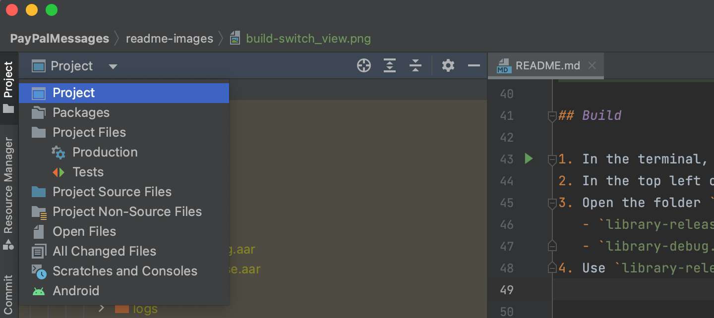

# PayPalMessages Android

A messaging component library allowing easy integration of PayPal Credit Messages onto your app.

> **Note:** This messaging component is intended for use with the **[Braintree SDK](https://developer.paypal.com/braintree/docs/guides/paypal/messaging/android/v5)** only. To integrate PayPal messaging in your Android app, you must have a Braintree account and the Braintree SDK integrated. PPCP SDK integrations are not supported.

- [Availability](#availability)
- [Contribution](#contribution)
- [Support](#support)
- [Client ID](#client-id)
- [Release Process](#release-process)
- [Testing](#testing)
- [Static Analysis Tools](#static-analysis-tools)
- [Build](#build)
- [Local Development and Troubleshooting](#local-development-and-troubleshooting)

## Availability
The library is currently in the development process. This product is being developed fully open source - throughout the development process, we welcome any and all feedback. Aspects of the library _will likely_ change as we develop the SDK. We recommend using the library in the sandbox environment until an official release is available. This README will be updated with an official release date once it is generally available.

## Contribution
As the library is moved to general availability, we will be adding a contribution guide for developers that would like to contribute to the library. If you have suggestions for features that you would like to see in future iterations of the library, please feel free to open an issue, PR, or discussion with suggestions. If you want to open a PR but are unsure about our testing strategy, we are more than happy to work with you to add tests to any PRs before work is merged.

## Support
The PayPalMessages Library is available for Android SDK 23+.

## Client ID

The PayPalMessages Library uses a client ID for authentication. This can be found in your [PayPal Developer Dashboard](https://developer.paypal.com/api/rest/#link-getstarted).

## Release Process
This library follows [Semantic Versioning](https://semver.org/). This library is published to Maven Central. The release process is automated via GitHub Actions.

### Using Gradle Tasks Directly
You can also use the Gradle tasks directly:

1. Set environment variables as above
2. Build and prepare:
   - `./gradlew clean :library:assembleRelease :library:generatePomFileForReleasePublication`

## Testing

This repository includes unit tests, integration tests, and end-to-end tests.

// TODO: Add sections with commands for running each type of tests

## Static Analysis Tools

// TODO: Add sections with commands for static analysis

## Build

1. In the terminal, run `./gradlew assemble`
2. In the top left corner, switch the folder view from **Android** to **Project**
3. Open the folder `library/build/outputs/aar/` to see these build files
	- `library-release.aar`
	- `library-debug.aar`
4. Use `library-release.aar` in your projects

## Local Development and Troubleshooting

See [our development guidelines](DEVELOPMENT.md)
